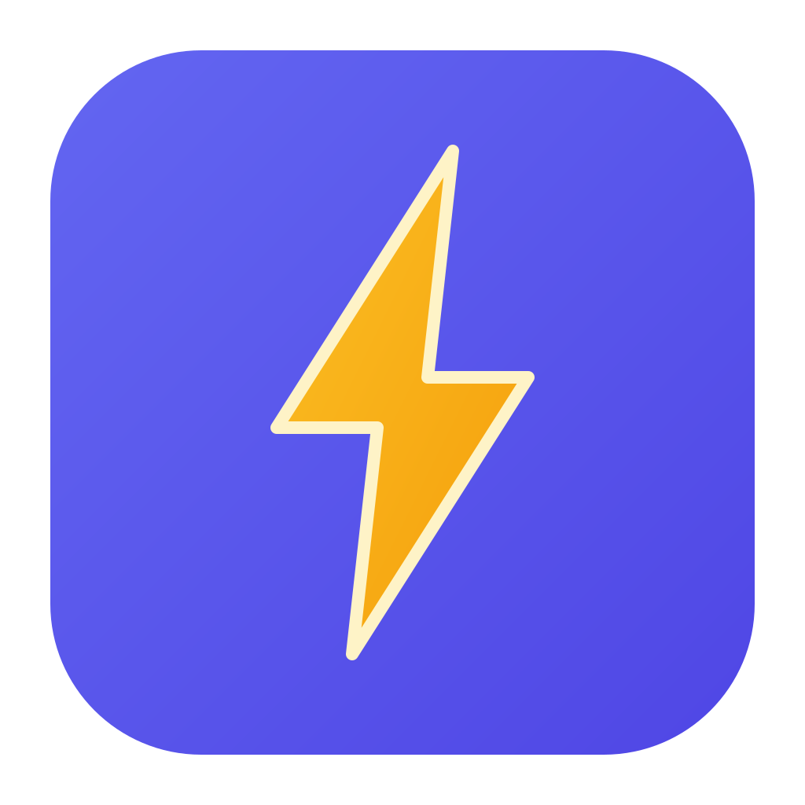

<p align="center">
  
</p>

<h1 align="center">SnapTray</h1>

<p align="center">
  <a href="README.md">English</a> | <a href="README.zh-TW.md">繁體中文</a> | <strong>日本語</strong> | <a href="README.ko.md">한국어</a> | <a href="README.th.md">ไทย</a>
</p>

---

<p align="center">
  デスクトップを離れずにキャプチャ、注釈、ピン留め。録画は macOS/Windows で利用できます。
</p>

<p align="center">
  macOS 14+ · Windows 10+ · Ubuntu 22.04 X11 beta
</p>

<p align="center">
  <a href="https://github.com/victorfu/snap-tray/releases">ダウンロード</a> ·
  <a href="docs/ja/docs/index.md">ドキュメント</a> ·
  <a href="docs/ja/docs/tutorials/index.md">チュートリアル</a>
</p>

SnapTray は macOS、Windows、Ubuntu 22.04 X11 beta に対応した Qt 6 のスクリーンショット・注釈アプリです。素早いデスクトップワークフローのために作られており、範囲をキャプチャし、その場で説明し、参照を画面に残しておけます。録画と OCR は macOS/Windows のみで、Linux beta では非表示であり含まれていません。

## SnapTray を選ぶ理由

- 拡大鏡による選択、ウィンドウ検出、複数範囲キャプチャ、カーソルを含めたキャプチャ、カラーピッカーで素早くキャプチャ
- 矢印、マーカー、図形、テキスト、モザイク、ステップバッジ、絵文字、QR コードスキャン、自動ぼかしですぐに注釈。OCR は macOS/Windows のみ
- スクリーンショットを他のウィンドウの上にピン留めし、作業中も参照を表示したままにできます
- macOS/Windows では、トレイメニューまたは録画ホットキーから画面全体を録画できます。シングルディスプレイでは直接開始し、マルチディスプレイでは画面を選択します
- グローバルホットキー、トレイメニュー、CLI から繰り返し使うフローを起動できます
- Linux beta：Ubuntu 22.04 X11 AppImage。録画と OCR は表示されません。

## 実際の業務のために

### キャプチャと注釈を一度に

`F2` を押して範囲をドラッグすると、同じツールバーからコピー、保存、ピン留め、ぼかしを実行できます。macOS/Windows では OCR もそこから利用できます。

> **注意：** 画像の共有（共有 URL へのアップロード）は現在無効です。共有ボタンはキャプチャとピン留めウィンドウのツールバーから非表示になっており、UI から実行することはできません。共有機能のコードは意図的に残してあるため、今後のビルドで再実装せずに再度有効化できます。

### デスクトップに直接描く

`Ctrl+F2 / Cmd+F2` でスクリーンキャンバスを開き、デモ、操作説明、プレゼンテーション、その場での解説に使えます。

### 参照を手元に置いたまま

ピン留めした画像は他のアプリの上に表示され、ズーム、不透明度、回転、反転、結合/レイアウト操作、インライン注釈に対応しています。

### 重要な内容を録画

macOS/Windows では、トレイメニューまたは録画ホットキーから開始し、必要に応じて画面を選び、フローティングコントロールバーで時間を確認して録画を停止します。

## さらに詳しく

- リリース：[GitHub Releases](https://github.com/victorfu/snap-tray/releases)
- ユーザードキュメント：[ドキュメントホーム](docs/ja/docs/index.md)
- チュートリアル：[チュートリアル一覧](docs/ja/docs/tutorials/index.md)
- CLI：[CLI リファレンス](docs/ja/docs/cli.md)
- トラブルシューティング：[トラブルシューティング](docs/ja/docs/troubleshooting.md)

## 開発者向け

SnapTray をソースからビルドしたい場合やコードベースに関わりたい場合は、[開発者ドキュメント](docs/developer/index.md)（英語）から始めてください。

クイックエントリーポイント：

```bash
# macOS/Linux beta
./scripts/build.sh
./scripts/run-tests.sh
```

```batch
REM Windows
scripts\build.bat
scripts\run-tests.bat
```

その他の開発者向けリファレンス（英語）：

- [ソースからビルド](docs/developer/build-from-source.md)
- [リリースとパッケージング](docs/developer/release-packaging.md)
- [アーキテクチャ概要](docs/developer/architecture.md)

## ライセンス

MIT License
